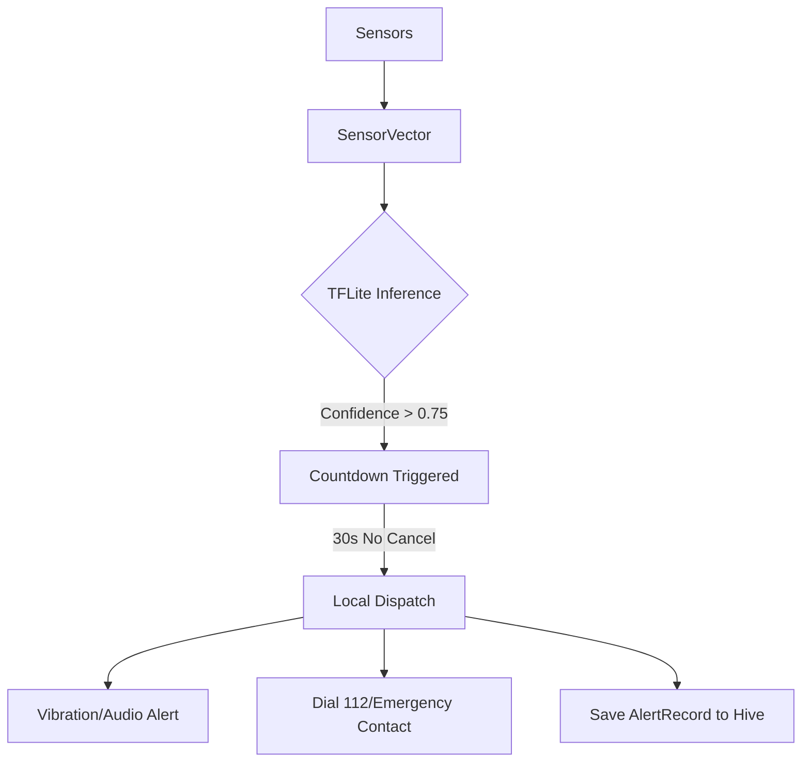

# 🛡️ CrashGuard: 100% Offline AI Accident Detection

CrashGuard is a privacy-first, on-device safety application that uses Machine Learning to detect vehicle accidents in real-time. Unlike traditional solutions, CrashGuard has **no backend server**, **no cloud dependencies**, and **no data tracking**. Everything from sensor fusion to ML inference happens locally on your smartphone.

---

## 🚀 The Core Innovation: "Ghost Mode" Architecture
CrashGuard replaces the traditional Mobile-Cloud-API stack with a high-performance **Local-Only Service Mesh**.

| Traditional Component | CrashGuard Replacement | Technical Implementation |
| :--- | :--- | :--- |
| **Backend API** | `LocalService` layer | Direct Hive DB queries & Service Providers |
| **SQL Database** | `Hive` | Encrypted, binary-serialized local storage |
| **Python ML Worker** | `TFLiteService` | Low-latency C++ ML inference via `tflite_flutter` |
| **Push Notifications** | `LocalNotificationService` | Direct OS channel scheduling |
| **Emergency Dispatch** | `url_launcher` | Direct `tel:` protocol intent dispatch |

---

## 🛠 Technical Architecture

### 1. High-Frequency Sensor Pipeline
The app samples data at **50Hz** to ensure zero-lag detection.
*   **Accelerometer**: Detects sudden impact G-forces and "Jerk" (da/dt).
*   **Gyroscope**: Monitors vehicle orientation and high-speed rotation (rollovers).
*   **GPS (Geolocator)**: Continuous speed monitoring to filter out low-speed impacts.
*   **Noise Meter**: Analyzes ambient decibel levels to confirm high-impact acoustic signatures.

### 2. ML Inference Engine (`TFLiteService`)
*   **Model**: `crash_model.tflite` (Optimized Float16 Quantization).
*   **Latency**: < 5ms per inference.
*   **Input Vector**: `[Accel_Mag, Gyro_Mag, GPS_Speed, Audio_Amp, Jerk]`.
*   **Fallback Logic**: If the TFLite interpreter fails to load, a heuristic `FallbackDetector` takes over using hard-coded physics thresholds.

### 3. Dispatch Logic


---

## 📂 Project Structure

```bash
lib/
├── core/
│   ├── constants.dart         # Normalization denominators & thresholds
│   ├── theme.dart             # System-wide Dark/Light themes
│   └── widgets/               # Reusable UI components
├── features/
│   ├── detection/             # SensorService & TFLite implementation
│   ├── alert/                 # Countdown UI and Dispatch logic
│   ├── health/                # Local Health Profile (Hive models)
│   ├── emergency/             # Offline Directory of Indian Helplines
│   └── documents/             # Offline storage for licenses/insurance
├── services/                  # Business logic (History, Notifications, Dispatch)
├── providers/                 # Riverpod State Management
└── main.dart                  # Background service & Hive initialization
```

---

## 🛠 Setup & Development

### Prerequisites
*   Flutter SDK `>= 3.3.0`
*   Android Studio / VS Code
*   A physical device (Sensors/GPS are required for testing)

### Installation
1.  **Clone the repo**:
    ```bash
    git clone https://github.com/your-username/crashguard.git
    cd crashguard
    ```
2.  **Install dependencies**:
    ```bash
    flutter pub get
    ```
3.  **Generate Hive adapters**:
    ```bash
    flutter pub run build_runner build --delete-conflicting-outputs
    ```
4.  **Run the app**:
    ```bash
    flutter run
    ```

### Running Tests
```bash
flutter test
```

---

## 🔒 Privacy & Security
*   **Data Sovereignty**: Your Health Profile, Location Logs, and Accident Records never leave the app's local sandbox (Internal Storage on Android / Documents on iOS).
*   **Zero Permissions Overreach**: Camera/Microphone access is only used for local analysis (audio levels) or optional document scanning; no data is uploaded.
*   **Offline First**: Designed for rural highways where 4G/5G is unreliable.

---